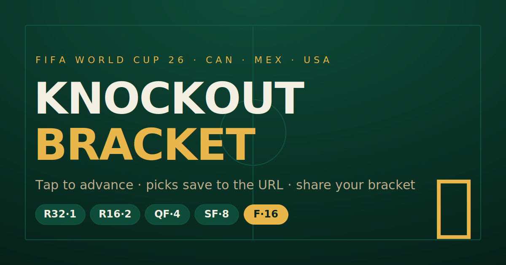

# World Cup 2026 — Knockout Bracket 🏆

An interactive, shareable FIFA World Cup 2026 knockout bracket. Tap a team to
advance it through every round; your picks are encoded in the URL so you can
share a fully-filled bracket with anyone. Scoring uses the conventional
exponentially-rising scheme. Add your name and **Submit** to enter a
leaderboard that's scored against the real results as they come in.

**No runtime backend, no tracking, no build step.** The site is static. Players
submit with no login via a Google Form; a small Apps Script + GitHub Actions turn
that into a scored leaderboard (see [Leaderboard](#leaderboard) and
[SETUP.md](../SETUP.md)).



## Features

- **Click to advance** — pick a winner in any match and it flows into the next
  round automatically along FIFA's fixed bracket paths.
- **Exponential scoring** — R32 = 1, R16 = 2, QF = 4, SF = 8, Final = 16.
  A perfect bracket totals **80 points**. The live counter shows what your
  current picks are worth.
- **Shareable URL** — every pick (and your name) is saved to the address bar.
  "Copy share link" hands someone your exact bracket.
- **Two tabs** — *Your bracket* (the landing view) and *Leaderboard*, with the
  active view reflected in the URL hash so links and the Back button work.
- **Name + PIN + Submit + leaderboard** — enter a name (shown on the leaderboard)
  and a PIN, and submit your bracket (no login — it posts to a Google Form). The
  PIN is **hashed in the browser** so it's never seen; it protects later edits under
  your name. An Apps Script + GitHub-Actions pipeline scores everyone against the
  official results and publishes a ranked, timestamped leaderboard showing each
  player's **points, max still reachable, and final-game prediction**. Ties break on
  the third-place game.
- **Save & reopen brackets** — enter your name and an inline **dropdown** lists every
  bracket you've submitted (across devices) to view or edit; the official one is
  marked, and a toggle promotes any of them to official. Keep several brackets per
  name; exactly one is your **official**, scored entry.
- **Live result feedback** — as official results are recorded, a pick that's
  proven wrong gets a red ✕, and any later pick whose team was already eliminated
  is greyed out with an ✕ (it can no longer come true).
- **Universal team codes** — teams render as FIFA-style three-letter codes
  (`BRA`, `FRA`, …), so they look identical on every OS/browser (emoji flags don't).
- **Third-place playoff** — losers of the semis, kept outside the points scheme
  (as is standard).
- **TBD slots** — matchups not yet confirmed show their group descriptor
  (e.g. `3rd C/D/F/G/H`) and a dashed code badge until results lock in.
- Responsive, keyboard-focusable, and respects `prefers-reduced-motion`.

## Quick start

Just open `index.html` in a browser. Because it loads the CSS/JS as separate
files, serve it over HTTP rather than `file://` for best results:

```bash
# any static server works — for example:
python3 -m http.server 8000
# then visit http://localhost:8000
```

## Hosting

### GitHub Pages (one click)
1. Push this repo to GitHub.
2. **Settings → Pages → Build and deployment → Source: GitHub Actions.**
   The included workflow (`.github/workflows/deploy.yml`) publishes the site on
   every push to `main`.
3. Your bracket goes live at `https://<user>.github.io/<repo>/`.

Prefer the no-Actions route? **Settings → Pages → Source: Deploy from a branch →
`main` / `(root)`** also works since everything is static.

### Anywhere else
Upload the folder to Netlify, Vercel, Cloudflare Pages, S3, or any static host.
There is nothing to build.

## Project structure

The bracket page lives in `wc2026/`; the scoring pipeline lives at the repo root
(so GitHub Actions picks it up).

```
<repo root>/
├── wc2026/
│   ├── index.html              # markup + page shell
│   ├── assets/styles.css       # all styling (design tokens at top)
│   ├── src/                    # ES modules (loaded from main.js)
│   │   ├── data.js             # teams, bracket tree, scoring — EDIT THIS (classic script)
│   │   ├── state.js            # shared state, active bracket, URL/localStorage, utils
│   │   ├── crypto.js           # client-side PIN hashing (SHA-256)
│   │   ├── tree.js             # match resolution: picks + official results → teams
│   │   ├── view.js             # bracket rendering, click interaction, score readout
│   │   ├── submissions.js      # load submissions/results + bracket helpers
│   │   ├── chooser.js          # inline bracket dropdown + make-official toggle
│   │   ├── submit.js           # Google Form submit + submit dialog (PIN here)
│   │   ├── leaderboard.js      # leaderboard fetch/render + tabs
│   │   └── main.js             # entry point: wiring + init
│   ├── data/
│   │   ├── results.json        # OFFICIAL RESULTS — hand-edited as games finish
│   │   └── submissions.json    # entrants' brackets (committed by the Apps Script)
│   └── leaderboard.json        # generated standings + last-updated time (fetched by the page)
├── scripts/
│   └── score_bracket.py        # scores submissions vs. results (parses data.js)
├── google-apps-script/
│   └── Code.gs                 # form → submissions.json ingestion (runs in Google, see SETUP.md)
├── .github/workflows/
│   └── leaderboard.yml         # score + commit leaderboard on each push
├── SETUP.md                    # one-time Google Form + Apps Script setup
├── LICENSE
└── README.md
```

## Updating teams as results come in

All tournament data lives in **`src/data.js`** — you never touch the logic.

Each Round-of-32 slot is either confirmed or projected:

```js
T("Brazil", "1C")   // T = confirmed team
P("France", "1I")   // P = projected / not-yet-locked slot (shown muted)
```

To confirm a team, change `P(...)` to `T(...)`. To swap a team, edit the name and
seed and make sure its three-letter code exists in the `CODES` map at the top of
the file (teams render as their FIFA-style code — e.g. `BRA`, `FRA` — not emoji
flags, so they display the same on every platform). The bracket tree (`TREE`)
follows FIFA's published paths and shouldn't need changes.

> **Array order is the layout.** `R32` (and each `TREE` round) is listed in
> *canonical spatial order* — walking the tree from the Final down, top feeder
> first — so every later-round match renders centered between its two feeders. If
> you ever restructure the tree, keep each round's array in that order (a quick
> sanity check: each match's two `from` ids must be an adjacent pair in the
> previous round's array).

## How scoring works

The classic doubling scheme rewards calling the later rounds correctly:

| Round | Per correct pick | Matches | Round total |
|-------|------------------|---------|-------------|
| Round of 32 | 1 | 16 | 16 |
| Round of 16 | 2 | 8 | 16 |
| Quarter-finals | 4 | 4 | 16 |
| Semi-finals | 8 | 2 | 16 |
| Final | 16 | 1 | 16 |
| **Total** | | **31** | **80** |

The counter shows the points your picks are *worth* if they all come true — it is
a projection tool, not a result tracker.

## Leaderboard

The leaderboard scores each submitted bracket against the **official results** and
ranks everyone — **no login for players, no runtime backend.**

**How a submission flows in** (one-time setup in [SETUP.md](../SETUP.md))

1. A visitor fills out their bracket, types a **name** (shown on the leaderboard),
   and clicks **Submit bracket**. A dialog asks for a **PIN**, an optional **label**,
   and whether to **make it their official entry**.
2. The page hashes the PIN (SHA-256, in the browser) and silently posts the bracket
   (name, label, encoded picks, a stable **bracket id**, the official flag,
   timestamp, and the **PIN hash** — never the PIN) to a **Google Form** — no GitHub
   account or login needed.
3. A **Google Apps Script** ([`google-apps-script/Code.gs`](../google-apps-script/Code.gs))
   bound to the form's response sheet verifies the PIN (for an existing name) and
   commits the entry into `wc2026/data/submissions.json`. That push triggers the
   [`leaderboard.yml`](../.github/workflows/leaderboard.yml) workflow, which scores
   everyone and commits `wc2026/leaderboard.json`. The page fetches it and shows each
   player's **points, max still reachable, and final-game prediction**, plus a *last
   updated* time. Ties are broken by the third-place game.

**Saving & reopening brackets**

Submissions persist in `wc2026/data/submissions.json`. When you enter your **name**,
the **Your bracket** tab shows an inline **dropdown** of every bracket you've saved
(the official one marked) plus a *New bracket* option; pick one to load and edit it.
A **Make this official** toggle promotes the selected bracket. Each bracket has a
stable id, so editing and re-submitting updates it in place rather than creating
duplicates. Only **one is your official (scored) entry**: your **first** submission
is official automatically; promoting another re-submits it as official (PIN
required) and demotes the previous one (enforced in the Apps Script).

> **Trust / PIN.** The first submission for a name sets that name's PIN (hashed in
> the browser — the maintainer never sees it). Later edits, new brackets, or
> official changes under that name require the matching PIN. Reading data is public,
> so pick a name that isn't trivially guessable. A just-submitted change only
> appears after the Apps Script commits and Pages rebuilds (seconds to a couple of
> minutes).

**Recording results (your job, occasionally)**

Edit [`wc2026/data/results.json`](data/results.json) and commit. For each match,
set the winning side — `"a"` (top team) or `"b"` (bottom team), matching the
slots on the page — and leave unplayed matches `null`:

```json
{ "winners": { "104": "a", "101": "b", "97": null, "103": "a" } }
```

Committing that file re-runs the workflow, which re-scores every submission and
refreshes the leaderboard's timestamp. Scoring reuses the same exponential weights
above. Match **`103`** (third-place game) earns no points but **breaks ties**:
among players level on points, the one who predicted 103 correctly ranks higher.

> Run the scorer locally anytime with `python3 scripts/score_bracket.py` — it reads
> `results.json` + `submissions.json` and rewrites `leaderboard.json`. Stdlib only,
> no dependencies.

## License

MIT — see [LICENSE](LICENSE). Teams are shown as FIFA-style three-letter codes.
Team data is factual tournament information.
